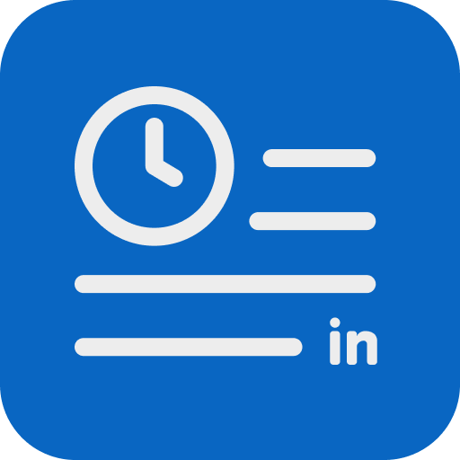
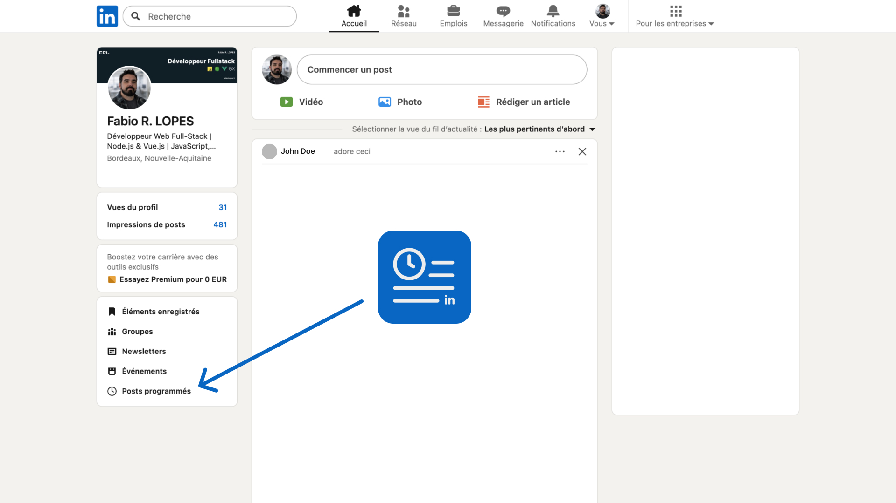

# LinkPost - Extension LinkedIn

Une extension Chrome simple qui ajoute un lien direct vers vos "Posts programmés" dans l'interface de LinkedIn.

## Fonctionnalités

- **Accès rapide** : Ajoute un lien "Posts programmés" directement dans le menu de navigation gauche du feed LinkedIn.
- **Intégration native** : Respecte le style visuel de LinkedIn pour une intégration transparente.
- **Léger & Sûr** : Pas de tracking, pas d'appels API, pas de permissions intrusives. Juste un script simple.

## Installation (Mode Développeur)

Cette extension n'est pas encore sur le Chrome Web Store. Vous pouvez l'installer manuellement :

1.  Téléchargez ou clonez ce dossier sur votre ordinateur.
2.  Ouvrez Google Chrome et allez sur `chrome://extensions`.
3.  Activez le **Mode développeur** via le bouton en haut à droite.
4.  Cliquez sur **Charger l'extension non empaquetée** (Load unpacked).
5.  Sélectionnez le dossier `LinkPost` (celui qui contient le fichier `manifest.json`).

L'extension est maintenant active !

## Utilisation

1.  Rendez-vous sur [LinkedIn](https://www.linkedin.com/feed/).
2.  Une fois sur votre feed, regardez le menu de navigation dans la colonne de gauche.
3.  Vous devriez voir apparaître le lien **"Posts programmés"** avec une icône d'horloge.
4.  Cliquez dessus pour visualiser vos posts programmés.

## Limitations connues

- L'extension dépend de la structure HTML de LinkedIn (sélecteur `.feed-left-nav-common-module__widgets`). Si LinkedIn met à jour son design, l'extension pourrait nécessiter une mise à jour.
- Le lien est injecté dynamiquement. Il peut apparaître avec un très léger délai après le chargement de la page.

## Structure du projet

- `manifest.json` : Configuration de l'extension (Manifest V3).
- `content.js` : Le script qui injecte le lien intelligemment.
- `icons/` : Les icônes de l'extension.
