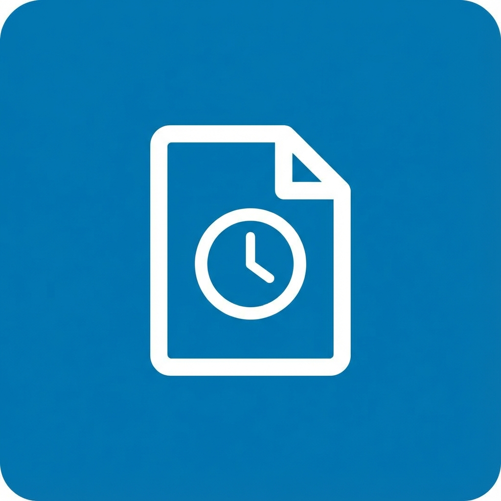

# LinkPost - Raccourcis Posts Programmés et plus

Une extension Chrome simple et personnalisable qui améliore votre expérience LinkedIn avec des raccourcis pratiques et une interface épurée.

## ✨ Fonctionnalités

### 🔗 Raccourcis Navigation

- **Posts programmés** : Accédez à vos posts en attente en un clic depuis le menu de navigation gauche.
- **Créer un post** : Ouvrez directement la fenêtre de création de publication.

### 🧹 Interface Épurée

- **Masquer pub Premium** : Cachez les encarts publicitaires LinkedIn Premium.
- **Masquer les jeux** : Supprimez la section jeux de votre fil d'actualité.

### ⚙️ Personnalisation

- **Popup de paramètres** : Activez/désactivez chaque fonctionnalité selon vos besoins.
- **Sauvegarde automatique** : Vos préférences sont conservées dans votre navigateur.

### 🎨 Intégration Native

- Design respectant l'interface officielle de LinkedIn.
- Léger et performant : ne ralentit pas votre navigateur.

## 🛡️ Confidentialité et Sécurité

- ✅ Aucune collecte de données personnelles
- ✅ Pas d'appels API externes
- ✅ Code open-source pour une transparence totale
- ✅ Préférences stockées localement uniquement

## 📥 Installation

### Chrome Web Store

L'extension est disponible sur le [Chrome Web Store](https://chrome.google.com/webstore).

### Mode Développeur

1. Téléchargez ou clonez ce dépôt sur votre ordinateur.
2. Ouvrez Google Chrome et allez sur `chrome://extensions`.
3. Activez le **Mode développeur** via le bouton en haut à droite.
4. Cliquez sur **Charger l'extension non empaquetée**.
5. Sélectionnez le dossier `LinkPost` (celui qui contient le fichier `manifest.json`).

## 🚀 Utilisation

1. Rendez-vous sur [LinkedIn](https://www.linkedin.com/feed/).
2. Regardez le menu de navigation dans la colonne de gauche.
3. Les nouveaux liens apparaissent avec leurs icônes dédiées.
4. Cliquez sur l'icône de l'extension pour accéder aux paramètres.

## ⚠️ Limitations connues

- L'extension dépend de la structure HTML de LinkedIn. Si LinkedIn met à jour son design, une mise à jour pourrait être nécessaire.
- Les liens sont injectés dynamiquement et peuvent apparaître avec un très léger délai.

## 📁 Structure du projet

```
LinkPost/
├── manifest.json    # Configuration de l'extension (Manifest V3)
├── content.js       # Script d'injection des liens
├── popup.html       # Interface du popup de paramètres
├── popup.js         # Logique du popup
├── popup.css        # Styles du popup
└── icons/           # Icônes de l'extension
```

## 📝 Note importante

Cette extension est un projet indépendant développé pour améliorer l'expérience utilisateur sur LinkedIn. Elle n'est pas affiliée, approuvée ou associée de quelque manière que ce soit à LinkedIn Corporation.

## 📄 Licence

MIT License - Voir le fichier LICENSE pour plus de détails.
